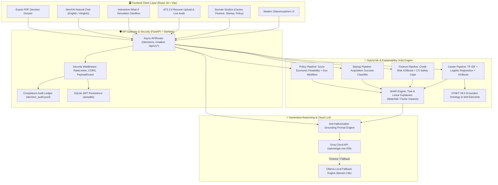
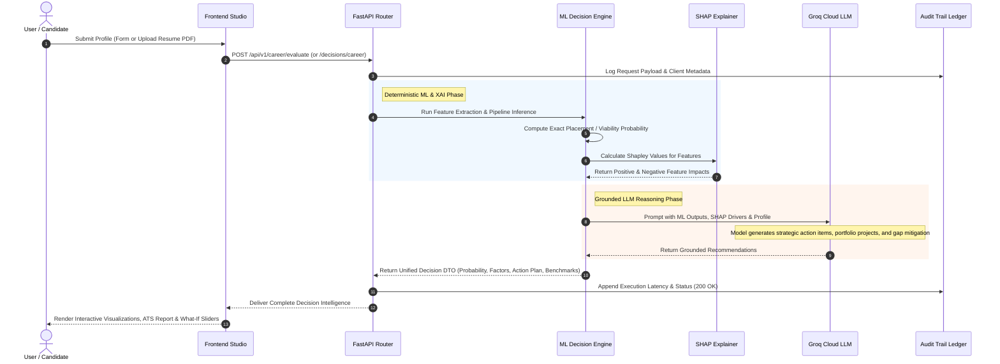
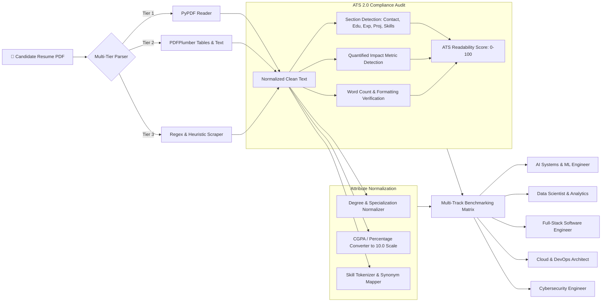
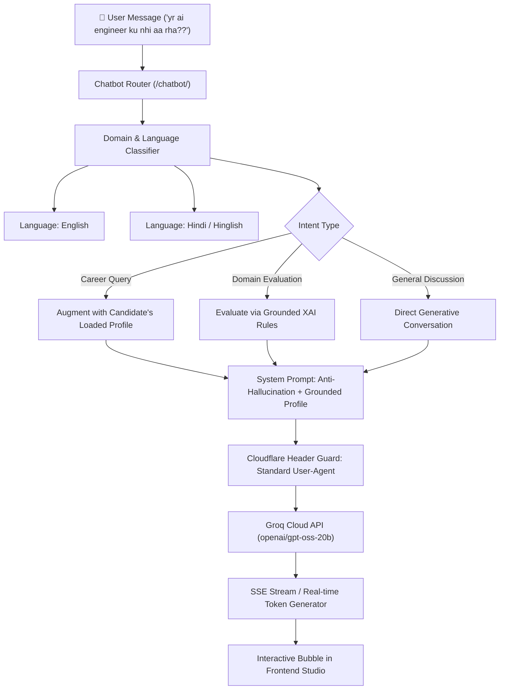

# 🚀 DeciXAI — Enterprise Explainable AI (XAI) Decision Intelligence Platform

<div align="center">


<p align="center">
  <strong>Grounded Multi-Domain Decision Intelligence &bull; Dynamic ATS 2.0 Resume Intelligence &bull; Transparent Explainability (SHAP) &bull; Immutable Regulatory Audit Trail</strong>
</p>

</div>

---

## 📖 Executive Overview

**DeciXAI** is an enterprise-grade, patent-ready **Hybrid Decision Intelligence Platform** that unites predictive Machine Learning (scikit-learn, XGBoost), Explainable AI (SHAP), RAG-grounded standard occupational ontologies (O*NET 29.0), and ultra-low-latency Large Language Model reasoning (**Groq Cloud API**) into a unified Decision Studio.

Traditional AI models are opaque "black boxes" that output arbitrary recommendations without justification or regulatory defensibility. **DeciXAI solves this by enforcing mathematical transparency at every step:**
1. **Never Hallucinate Scores:** Exact numerical probabilities and decision rankings are calculated deterministically by specialized ML pipelines and safety guardrails.
2. **Explain Every Factor (XAI):** Raw model outputs are decomposed into quantified positive and negative factor contributions via SHAP (SHapley Additive exPlanations).
3. **Generative Strategic Reasoning:** The cloud LLM receives strictly verified context and SHAP attributions to assemble personalized roadmaps, project architectures, and strategic counterfactual recommendations.
4. **ATS 2.0 Resume Intelligence:** Live multi-tier parsing (PyPDF, PDFPlumber, regex fallback) extract candidates' credentials, metrics, and skills, benchmarking them against multi-track industry roles (AI/ML Engineer, Full-Stack, Cloud/DevOps, Data Scientist, Cybersecurity).
5. **Regulatory Compliance:** Every transaction, payload, latency profile, and model output is cryptographically tracked in an immutable audit ledger (`decision_audit.jsonl`).

---

## 🏛️ High-Level System Architecture

The following diagram illustrates how the frontend Decision Studio communicates with the FastAPI asynchronous gateway, ML inference pipelines, SHAP explainers, Groq cloud reasoning, and the compliance ledger:



---

## 🎯 Core Domain Capabilities

DeciXAI delivers specialized decision intelligence across four enterprise domains:

### 1. 🎓 Career & Talent Intelligence (ATS 2.0)
* **Multi-Tier Dynamic Resume Parsing:** Ingests complex PDFs using a resilient multi-tier pipeline (`PyPDF` &rarr; `PDFPlumber` &rarr; heuristic text cleaners & regex fallback).
* **ATS Compliance Audit:** Scans required sections (Contact, Education, Experience, Projects, Skills, Certifications) and checks for quantified metrics (e.g., *latency reduced by 40%*, *served 10k users*).
* **Automatic Attribute Normalization:** Unifies CGPA (4.0, 10.0 scale or percentages), degree classifications, study year, and tokenized skills.
* **Multi-Track Role Benchmarking:** Evaluates candidate credentials simultaneously across 5 core industry tracks:
  1. `AI Systems & Machine Learning Engineer`
  2. `Data Scientist & Analytics Engineer`
  3. `Full-Stack Software Engineer`
  4. `Cloud & DevOps Architect`
  5. `Cybersecurity Engineer`
* **Dual-Track Alignment:** Compares the candidate's self-selected target track against their system-detected best fit, pinpointing skill and project gaps.

### 2. 💳 Finance & Credit Risk Intelligence
* **Default Risk Classification:** Evaluates financial profiles using gradient-boosted decision trees trained on historical credit risk datasets.
* **Deterministic Guardrails:** Hard safety caps override pure ML probabilities when risk thresholds are breached (e.g., Loan-to-Income ratio > `0.8` or Credit Score < `600`).
* **Counterfactual Recommendations:** Calculates the exact debt reduction or income boost required to transition from *High Risk* to *Credit Approved*.

### 3. 🚀 Startup & Venture Intelligence
* **Acquisition & Viability Classifier:** Forecasts startup survival and funding potential based on team dynamics, funding runway, and founder experience.
* **Cohort Percentile Benchmarking:** Directly benchmarks the venture's metrics against the 25th and 50th percentiles of historical high-growth cohorts to identify immediate hiring needs or capital deficiencies.

### 4. 🏛️ Public Policy & Governance Intelligence
* **Socio-Economic Feasibility Classifier:** Predicts public policy execution success based on budgetary allocations, target demographic size, and historical Indian scheme metrics.
* **Governance Multipliers:** Dynamically adjusts raw feasibility according to political support, infrastructure readiness, corruption risk, and administrative urgency.

---

## 🔬 End-to-End Decision Flow & Anti-Hallucination Pipeline

The following sequence illustrates how DeciXAI safeguards against LLM hallucinations by calculating mathematical predictions first and using the LLM exclusively for strategic synthesis:



---

## 📄 ATS 2.0 Resume Intelligence Deep-Dive

DeciXAI features a complete ATS 2.0 parsing and candidate scoring subsystem:



---

## 💬 DeciXAI Conversational Intelligence (Chatbot)

The platform embeds a natural conversation assistant supporting both **English** and **Hindi/Hinglish**:



---

## 🛠️ Technology Stack

| Layer | Technology | Function in DeciXAI |
| :--- | :--- | :--- |
| **Frontend Framework** | **React 18.3.1**, **Vite 5.3.15** | Component-driven reactive UI, fast HMR development, modern state management |
| **Styling & Design** | **Tailwind CSS 3.4.3**, **Vanilla CSS** | Curated Glassmorphism design system, dark-mode styling, responsive viewports |
| **Routing & Navigation** | **React Router DOM 6.18.1** | Domain route orchestration, client-side breadcrumb navigation, dynamic modals |
| **Backend API Gateway** | **FastAPI 0.109.0**, **Uvicorn 0.24.0** | Asynchronous HTTP endpoints, streaming responses (SSE), Pydantic v2 schemas |
| **Machine Learning** | **scikit-learn 1.5.2**, **XGBoost 2.1.4** | Classification, logistic regression, TF-IDF vectorization, calibrated probabilities |
| **Explainable AI (XAI)** | **SHAP 0.42.0+** | TreeExplainer and LinearExplainer for feature importance and waterfall attribution |
| **Generative AI (Cloud)**| **Groq Cloud API (`openai/gpt-oss-20b`)** | Lightning-fast narrative reasoning, career action plans, anti-hallucination synthesis |
| **Generative AI (Local)**| **Ollama (`llama3.1:8b`)** | Fully offline optional fallback for air-gapped deployments |
| **Document Processing** | **PyPDF 4.0.0+**, **PDFPlumber 0.10.0+** | Multi-tier PDF parsing, table extraction, and ATS compliance verification |
| **Report Generation** | **ReportLab 4.4.5** | High-resolution PDF Decision Dossier generation with embedded audit tables |
| **Database & Auth** | **SQLite**, **aiosqlite 0.19.0**, **PyJWT**, **bcrypt** | Secure user authentication, password hashing, and saved project persistence |
| **Compliance & Ledger** | **Starlette Middleware**, **JSON Lines (JSONL)** | Immutable request-level transaction recording (`decision_audit.jsonl`) |

---

## 📂 Project Structure

```
19 Decision XAI/
├── backend/
│   ├── datasets/                      # Raw tabular datasets & O*NET 29.0 taxonomy tables
│   ├── middleware/                    # Security middlewares (RateLimiter, Audit Ledger)
│   ├── models/                        # Serialized ML model bundles (*_model.joblib)
│   ├── routers/                       # FastAPI router modules
│   │   ├── audit.py                   # GET /api/v1/audit/logs
│   │   ├── auth.py                    # POST /api/v1/auth/register, login, me
│   │   ├── career.py                  # POST /api/v1/career/evaluate, parse-resume
│   │   ├── chatbot.py                 # POST /chatbot/, detect-domain
│   │   ├── decisions.py               # POST /decisions/{domain}
│   │   ├── export.py                  # POST /api/v1/export/pdf
│   │   └── projects.py                # CRUD /api/v1/projects
│   ├── services/                      # Domain business logic & explainability
│   │   ├── career_service.py          # Career classification & transition mapping
│   │   ├── chatbot_service.py         # Groq/Ollama streaming chat & domain routing
│   │   ├── finance_service.py         # Credit risk ML & LTI guardrails
│   │   ├── hybrid_decision_service.py # Dual-track scoring & benchmark matrices
│   │   ├── llm_action_plan_service.py # Generative action plan builder
│   │   ├── policy_service.py          # Public policy feasibility engine
│   │   ├── resume_parser_service.py   # Multi-tier ATS 2.0 resume extractor
│   │   ├── shap_service.py            # SHAP feature impact calculators
│   │   └── startup_service.py         # Startup survival & cohort gap analysis
│   ├── utils/                         # Database helpers, loggers, prompt parsers
│   ├── Dockerfile                     # Containerization blueprint for backend
│   ├── main.py                        # FastAPI entrypoint, lifespan warmup & CORS
│   ├── requirements.txt               # Locked Python dependencies
│   └── train_models.py                # ML pipeline training & serialization script
├── frontend/
│   ├── public/                        # Static assets & sample resumes
│   ├── src/
│   │   ├── components/                # Reusable UI widgets
│   │   │   ├── AppSidebar.jsx         # Navigation sidebar with domain quick-switch
│   │   │   ├── ChatWidget.jsx         # Floating/inline conversational AI assistant
│   │   │   ├── DecisionReport.jsx     # XAI visualizer (SHAP impacts, benchmarks)
│   │   │   ├── InsightPanel.jsx       # Strategic summary & action plan card
│   │   │   └── ResumeAuditCard.jsx    # ATS 2.0 compliance audit visualizer
│   │   ├── domains/                   # Modular domain engines
│   │   │   ├── career/                # Career form, resume uploader & benchmarking
│   │   │   ├── finance/               # Financial parameters & debt slider form
│   │   │   ├── startup/               # Startup parameters & funding runway form
│   │   │   ├── policy/                # Public policy & governance modifiers form
│   │   │   └── common/                # Shared layout, prompt bar, and mode tabs
│   │   ├── pages/                     # Application views (Home, DomainPage, SavedProjects, AuditTrail)
│   │   ├── api.js                     # Native fetch client wrapper with auth interceptor
│   │   └── App.jsx                    # Root router & global splash controller
│   ├── package.json                   # Frontend npm packages
│   └── vite.config.js                 # Vite bundler configuration
├── .env.example                       # Documented environment variable template
├── docker-compose.yml                 # Multi-container local/production deployment
└── README.md                          # Enterprise documentation & architectural guide
```

---

## 📡 REST API Reference

All backend endpoints are available with interactive OpenAPI documentation at `http://localhost:8002/docs`.

### 1. Decision & XAI Endpoints
| Method | Route | Description | Key Payload Fields |
| :--- | :--- | :--- | :--- |
| `POST` | `/decisions/{domain}` | Primary decision engine for any of the 4 domains (`career`, `finance`, `startup`, `policy`). Returns probability, score band, SHAP factors, and LLM advice. | Domain-specific input DTO |
| `POST` | `/api/v1/career/parse-resume` | ATS 2.0 PDF parsing endpoint. Ingests raw resume, extracts credentials, checks ATS compliance, and tokenizes skills. | `file: UploadFile` (Multipart) |
| `POST` | `/api/v1/career/evaluate` | Specialized career evaluation returning multi-track benchmark scores, best-fit role, and O*NET mapped titles. | Normalized CareerInput DTO |
| `POST` | `/api/v1/export/pdf` | Compiles a formatted Decision Dossier PDF complete with SHAP charts and strategic action plans. | Decision response payload |

### 2. Conversational Intelligence Endpoints
| Method | Route | Description | Key Payload Fields |
| :--- | :--- | :--- | :--- |
| `POST` | `/chatbot/` | Streaming (SSE) or JSON conversational endpoint powered by Groq Cloud (`openai/gpt-oss-20b`). | `{"message": str, "stream": bool, "messages": list}` |
| `POST` | `/chatbot/detect-domain` | Lightweight classifier determining domain intent (`career`, `finance`, `startup`, `policy`, `general`) and language (`english`, `hindi`). | `{"message": str}` |

### 3. Project Persistence & Regulatory Audit
| Method | Route | Description | Key Payload Fields |
| :--- | :--- | :--- | :--- |
| `GET` | `/api/v1/audit/logs` | Fetches recent entries from the immutable compliance audit ledger (`decision_audit.jsonl`). | Query params: `limit=50` |
| `POST` | `/api/v1/projects` | Saves an evaluated decision scenario with pinned baseline for what-if comparisons. | Project DTO + User Token |
| `GET` | `/api/v1/projects` | Lists all saved projects for the authenticated user. | Bearer Token in Header |
| `POST` | `/api/v1/auth/register` | Registers a new user account with bcrypt-hashed credentials. | `{"username": str, "password": str}` |
| `POST` | `/api/v1/auth/login` | Authenticates user and returns a signed JWT bearer token. | `{"username": str, "password": str}` |

---

## 🚀 Installation & Quickstart

### Prerequisites
- **Python:** `3.10` or `3.11`
- **Node.js:** `18.x` or `20.x` (with `npm`)
- **Groq API Key:** Free key available from [Groq Cloud Console](https://console.groq.com/) *(Optional: Local Ollama)*

---

### Step 1: Clone Repository & Configure Environment

```bash
git clone https://github.com/RiyanshiVerma-11/DeciXAI.git
cd DeciXAI
```

Create a `.env` file in the root directory:
```bash
cp .env.example .env
```

Ensure your `.env` contains:
```env
# Frontend -> Backend connection
VITE_API_BASE_URL=http://localhost:8002

# Backend configuration
BACKEND_HOST=0.0.0.0
BACKEND_PORT=8002

# Frontend configuration
FRONTEND_PORT=3002

# CORS Allowed Origins
CORS_ALLOWED_ORIGINS=http://localhost:3000,http://localhost:3001,http://localhost:3002,http://localhost:5173

# ML Model Storage
MODEL_DIR=./models

# Groq Cloud LLM Configuration (Lightning Fast)
GROQ_API_KEY=your_groq_api_key_here
GROQ_API_URL=https://api.groq.com/openai/v1/chat/completions
GROQ_MODEL=openai/gpt-oss-20b
GROQ_TIMEOUT_SECONDS=60
```

---

### Step 2: Run Backend (FastAPI)

```bash
# Navigate to backend directory
cd backend

# Install Python dependencies
pip install -r requirements.txt

# Launch FastAPI with Uvicorn
python -m uvicorn main:app --host 0.0.0.0 --port 8002
```
* **API Root:** [http://localhost:8002](http://localhost:8002)
* **Interactive Docs (Swagger):** [http://localhost:8002/docs](http://localhost:8002/docs)

---

### Step 3: Run Frontend (React 18 + Vite)

In a new terminal:
```bash
# Navigate to frontend directory
cd frontend

# Install Node modules
npm install

# Start Vite Development Server
npm run dev
```
* **Studio Interface:** [http://localhost:3002](http://localhost:3002) *(or Vite assigned port)*

---

### Step 4: Docker Compose Run (Optional)

To spin up both frontend and backend in isolated production containers:
```bash
docker compose up --build
```

---

## 🔬 Model Training & Serialization

DeciXAI includes an automated training and serialization pipeline to reproduce or update all four domain models:

```bash
python backend/train_models.py
```

* **Training Inputs:** Reads tabular data from `backend/datasets/` (e.g., student placement data, credit risk profiles, venture outcomes, governance schemes).
* **Artifact Outputs:** Builds preprocessing pipelines, trains scikit-learn & XGBoost estimators, calculates baseline metrics, and saves bundles to `backend/models/{domain}_model.joblib`.
* **Summary Metadata:** Generates `backend/models/training_summary.json` containing accuracy, precision, recall, and cross-validation scores.

---

## 🔒 Security, Compliance & Regulatory Audit

DeciXAI satisfies enterprise governance and auditability requirements:
1. **Audit Ledger (`decision_audit.jsonl`):** Starlette middleware records every decision event, hashing sensitive identifiers, capturing client IP, latency (ms), timestamp, and input parameters.
2. **Rate Limiting:** Managed via `slowapi` to prevent API exhaustion and DDoS attempts.
3. **Payload Sanitization:** Pydantic schemas enforce bounds on all numeric fields (e.g., CGPA `[0, 100]`, Credit Score `[300, 850]`, Budget `[>= 0]`).
4. **Cloudflare WAF Guard:** LLM clients use verified browser user agents and authorization headers to guarantee uninterrupted communication with modern AI providers.

---

## 📄 License & Attribution

This project is licensed under the **MIT License**.

Developed with ❤️ by **Riyanshi Verma** — Transforming complex machine learning and explainable AI into actionable decision intelligence.
